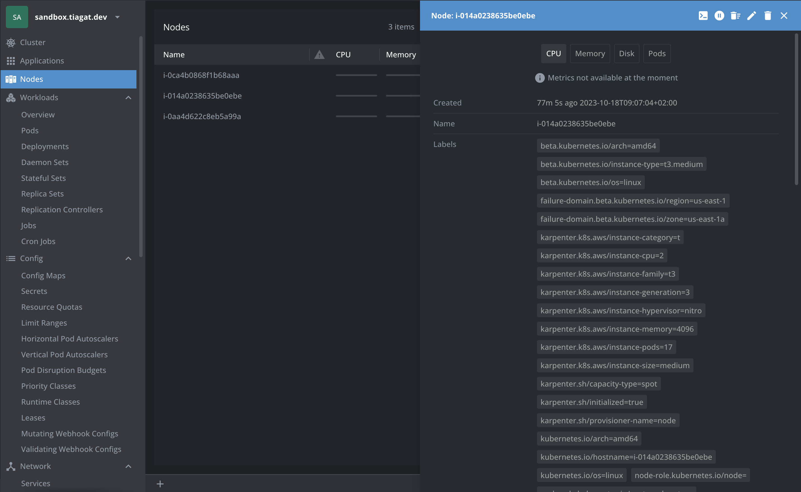
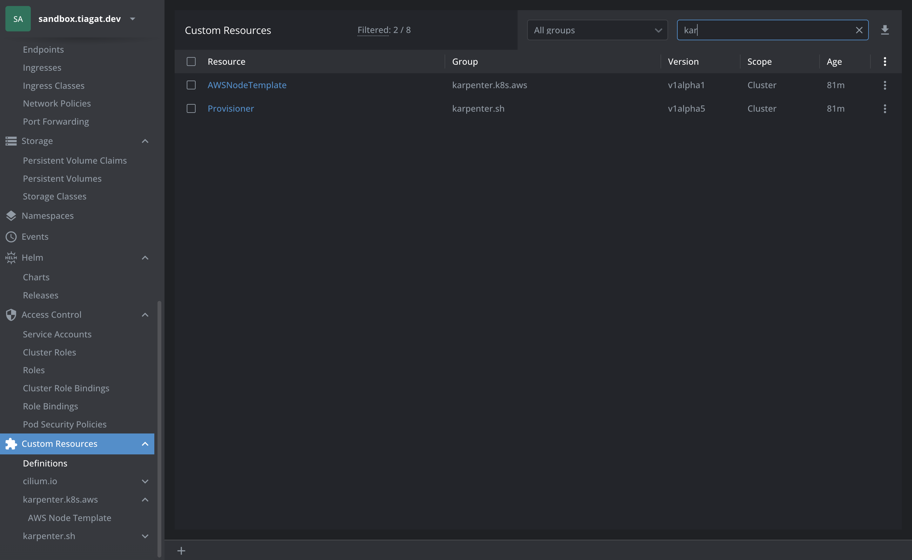
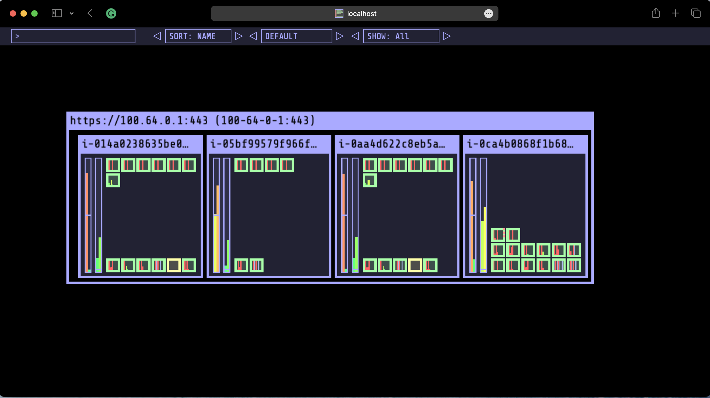

# Karpenter PoC

## Тестове оточення

Доя виконання задачі мені потрібен сам кластер Kubernetes, оскільки у нас в інфраструктурі використовується kOps то логічно було створити тестове оточення (пісочницю) на його основі. Ну і мені додаткова практика

Тестова інфраструктура розгорнута через Terraform в прватному AWS профілі

```
terraform {

    required_version = ">= 1.2.6"

    kops = {
      source  = "eddycharly/kops"
      version = "1.25.4"
    }

  }
}

```

Всі скрипти в можна подивтися тут [tiagat/kops-karpenter-poc](https://github.com/tiagat/kops-karpenter-poc)

Тестовий кластер:


## Karpenter

Для роботи з Karpenter через kOps треба аказати "feature flag":

```
export KOPS_FEATURE_FLAGS="Karpenter"
```

І немає значення, ми працюємо з CLI чи модулями Terraform. Без цьої змінної будь-яка спроба використання Karpenter в конфігурації кластера призведе до помилки


### Інсталяція

Karpenter як продукт складається з двох компонентів:

- Controller (сервіс який безпосередньо виконує функцію масштабування)
- Provisioner (CRD з конфішурацією поведінки скейлера)

в kOps є готова інтеграція з Karpenter ([kOps managed addons](https://kops.sigs.k8s.io/addons/#karpenter)) тому сам проце інсталяції на новому кластері максимально простий

- підготувати S3 бакет і IAM політики
- увімкнути Karpenter в конфігурації кластера
- вказати Karpenter як `manager` для русурсі `kops_instance_group`

EC2 ноди


Kubernetes ресурси






## Перевірка роботи скейлера

- inflate `public.ecr.aws/eks-distro/kubernetes/pause:3.7`
- візуалізація: `hjacobs/kube-ops-view:23.5.0`

Step 1: initial state


Step 2: scale `inflate` from 0 to 16 replicas



- скейлер прийняв рішення, створив ноду `i-05bf99579f966fce1` яка перейшла в стен **READY** - за 2 хвилини


- зворотній процес відбувається практично відразу (на конфігурації по замовчуванню)

## Про що варто поговорити

- Karpenter розроблений компанією Amazon і наразі працює тільки з AWS API. Якщо стоїть на меті підтримка/впровадження/міграція "multi-cloud", "cload agnostic" то це рішення не спрацює

- В силу тісної інтеграції модуля Karpenter з kOps ми повністю втрачаємо в гнучкості налаштування Provisioner'а якщо використовувати саме addon для kOps. Віргіще це можливо, але прийдеться конфігурувати CRD у відповідності до реалізації kOps.

[Known limitations: Unmanaged Provisioner resources](https://kops.sigs.k8s.io/operations/karpenter/#unmanaged-provisioner-resources)
